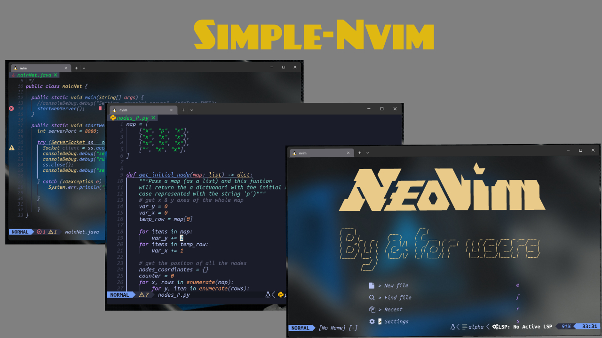

Deutsch?
<PLACEHOLDER FOR GERMAN DOCUMENTATION>

Español?
<PLACEHOLDER FOR SPANISH DOCUMENTATION>

# Simple Nvim

**A simple but feature-rich Neovim configuration written in Lua.**



## Features

## Features

<details>
    <summary style="font-size: 1.5em; font-weight: bold;">Amazing Plugins!!</summary>

- **This configuration uses Lazy.nvim to manage the following plugins:**
    - **Telescope**: For file navigation. (More info at [Telescope](https://github.com/nvim-telescope/telescope.nvim))
    - **Alpha-nvim**: For configuring the banner. (More info at [Alpha-nvim](https://github.com/goolord/alpha-nvim))
    - **Lua-line**: To personalize the status line. (More info at [Lua-line](https://github.com/nvim-lualine/lualine.nvim))
    - **Treesitter**: For better syntax highlighting. (More info at [Treesitter](https://github.com/nvim-treesitter/nvim-treesitter))
    - **LSP Servers with Mason**: For Language Server Protocol support. (More info at [Mason](https://github.com/williamboman/mason.nvim))
    - **Toggleterm**: For better terminal integration. (More info at [Toggleterm](https://github.com/akinsho/toggleterm.nvim))
    - **Git Integration**: To show changes in the current file. (More info at [Git Plugin](https://github.com/lewis6991/gitsigns.nvim))
    - **Indentation Lines**: To show indentation lines. (More info at [Indent](https://github.com/lukas-reineke/indent-blankline.nvim))
    - **Auto-pairs**: To auto-complete characters such as '(', '{', etc. (More info at [Auto-pairs](https://github.com/windwp/nvim-autopairs))
    - **Coke-line**: To manage the open buffers. (More info at [CokeLine](https://github.com/willothy/nvim-cokeline))
    - **nvim-colorizer**: To highlight colors in your code. (More info at [nvim-colorizer](https://github.com/nvim-colorizer/nvim-colorizer.lua))
    - **markdown-preview.nvim**: To preview Markdown files in a web browser. (More info at [markdown-preview.nvim](https://github.com/iamcco/markdown-preview.nvim))
    - **lazydev.nvim**: Provides a framework for developing Neovim plugins. (More info at [lazydev.nvim](https://github.com/folke/lazydev.nvim))
    - **todo-comments.nvim**: Highlights and manages TODO comments in your code. (More info at [todo-comments.nvim](https://github.com/folke/todo-comments.nvim))

    **All plugins and their configurations are in `~/.config/nvim/lua/plugins`.**

</details>


## Installation

### Automatic (Recommended) (Linux Only)

Run this command and the automatic installer will set everything up for you:

```bash
curl -sSL https://raw.githubusercontent.com/thelibertti/simple-Nvim/main/father.sh | bash -s -- -I
```

### Manual (Linux and Windows)

**1:** Clone this repo with:

```bash
git clone https://github.com/thelibertti/simple-Nvim.git
```

**2:** Go into the repo with
```bash
cd simple-Nvim
```

**3:** Copy the contents of simple-Nvim into your Neovim configuration directory:

- **Linux:** 
```bash
cp -r * ~/.config/nvim/
```
- **Windows:** 
```Powershell
Copy-Item -Recurse -Path .\* -Destination $env:LOCALAPPDATA\nvim\
```

And you all set now just run the ```nvim``` command and start exploring the cofiguration
