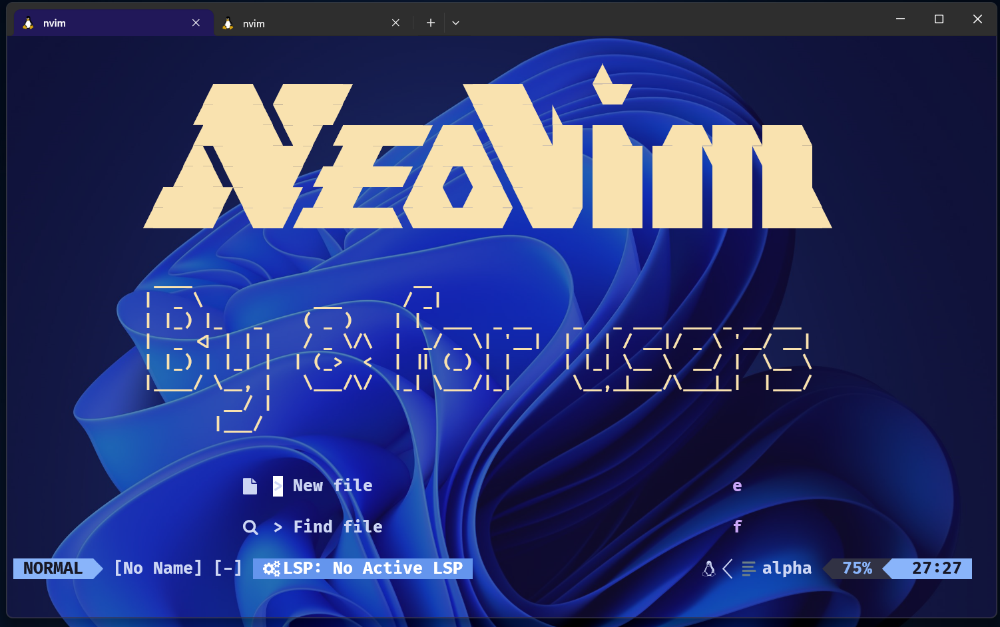
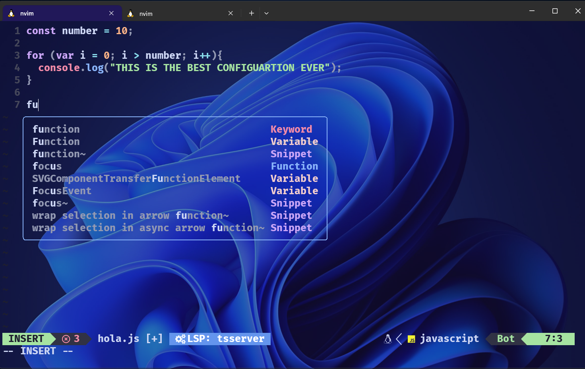

Dutch?
<PLACEHOLDER FOR GERMAN DOCUMENTATION>

Español?
<PLACEHOLDER FOR SPANISH DOCUMENTATION>


<h1>What is this project?</h1>




**This is simple but features rich configuration of neovim written in lua this configuration uses lazy nvim to managed the following plugins**

- Telescope for file navigation (more info at [Telescope](https://github.com/nvim-telescope/telescope.nvim))

- Alpha-nvim for the configuration's banner (more info at [Alpha-nvim](https://github.com/goolord/alpha-nvim))

- Lua-line, a line that looks cool I guess (more info at [Lua-line](https://github.com/nvim-lualine/lualine.nvim))

- Catppuccino theme for the configuration (more info at [Catppuccino](https://github.com/catppuccino/nvim))

- Treesitter for better syntax highlighting (more info at [Treesitter](https://github.com/nvim-treesitter/nvim-treesitter))

- LSP servers with Mason (more info at [Mason](https://github.com/williamboman/mason.nvim))

- Telescope, another file navigator (more info at [Telescope](https://github.com/nvim-telescope/telescope.nvim))

- Luasnip for code snippets (more info at [Luasnip](https://github.com/L3MON4D3/LuaSnip))

- None-ls (more info at [None-ls](https://github.com/nvimtools/none-ls.nvim))





**ALL PLUGINS AND THEIR CONFIGURETIONS ARE IN** 
```bash
cd ~/.config/nvim/lua/plugins
```
<h1>HOW TO INSTALL?</h1>

### Step One
First, ensure that Neovim is installed on your system, and you have a .config directory for the configuration. If you don't see the .config directory in your home directory, create it by running:

```bash
mkdir -p ~/.config/nvim
```

If you already have a .config directory but don't see the nvim directory inside, create it with the following command:
```bash
mkdir -p ~/.config/nvim
```

### Step two 

Navigate to .config/nvim using the following command:
```bash
cd ~/.config/nvim
```
Clone this repository with the following command:
```bash
git clone https://github.com/klkgang/neovim-for-newbs_with_DOCS
```
Enter the cloned directory with the next command:
```bash
cd neovim-for-newbs_with_DOCS
```
Set everything up with the following command:
```bash
mv ~/.config/nvim/neovim-for-newbs_with_DOCS/* ~/.config/nvim/
```

That's it! Now simply run nvim and start exploring the configuration.


<h1>Shortcuts</h1>

:information_source: To make this process easier you first should go into `~/nvim/lua/` and look for the file called `vim-options.lua` and open it and look for the next line of code 
```lua
vim.g.mapleader = " "
```
Inside the semicolons, you can choose any key to serve as your leader key. It's recommended to avoid common keys such as Shift or Control as they may cause conflicts. In my case, I've chosen to use the , comma as the leader key.

**shortcuts for Navigation**
- `Control + b`: this will take you the top of the file
- `Control + f`: this will take you down in the file 
- `Control + Space`: this will move the cursor beetween the lines of your file 
- `Control + e`: this will move you smooty to the bottom of your file

**Shortcuts for lsp**

- `Shift + K`: this will try the documentation of whatever the cursor is on
- `<Leader> + gr`: this will show all the references that the word that is the cursor on has 
- `<leader> + gd`: this will just show all the times that word is in the file


**Shortcuts for neo-tree**

- `Control + n` will open neo-tree
- `<Leader> + bf` will show just the files that you have open

### WORK IN PROGRESSS....
